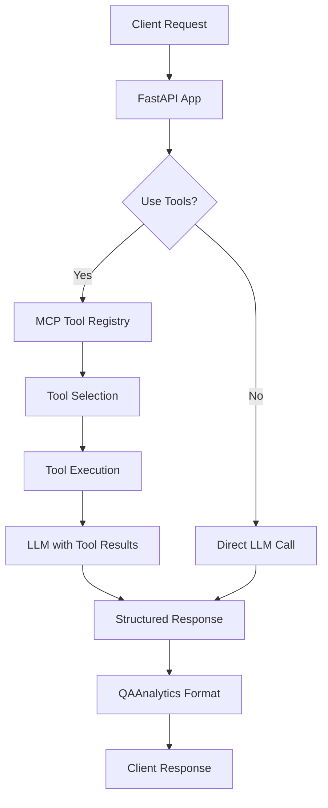

# FastAPI LLM API with MCP Tools Integration

A sophisticated FastAPI-based Large Language Model (LLM) API that integrates with Model Context Protocol (MCP) tools to provide enhanced, tool-augmented responses. This project demonstrates how to create an intelligent API that can access external tools and services to provide more comprehensive and accurate answers.

## 🚀 Overview

This project is a production-ready FastAPI application that serves as an intelligent LLM API with the following key capabilities:

- **🧠 LLM Integration**: Powered by OpenAI's GPT-4o-mini model
- **🔧 MCP Tools Support**: Extensible tool system for external integrations
- **📊 Structured Responses**: Standardized analytics format with questions, answers, thoughts, and topics
- **🎯 Dual Mode Operation**: Both tool-enabled and legacy tool-free endpoints
- **📈 Comprehensive Testing**: Full test coverage with mocking for reliable development
- **🔍 Rich Tool Set**: Support for Notion, web search, file operations, and codebase analysis

## 🏗️ Architecture

### Core Components

```
fastapi-llm-api/
├── llm_app.py                 # Main FastAPI application
├── mcp_integration.py         # MCP tools registry and handlers
├── test_llm.py               # LLM functionality tests
├── test_mcp_integration.py   # MCP tools tests
├── MCP_INTEGRATION.md        # Detailed MCP documentation
└── README.md                 # This file
```

### System Architecture



## 🛠️ Features

### 1. **Intelligent Tool Selection**
The LLM automatically determines which tools to use based on the user's question:
- **Notion Search**: For organizational knowledge queries
- **Web Search**: For real-time information needs
- **File Operations**: For code and document analysis
- **Codebase Search**: For development-related queries
- **Database Operations**: For structured data queries

### 2. **Structured Response Format**
All responses follow the `QAAnalytics` schema:
```json
{
    "question": "User's original question",
    "answer": "Comprehensive answer with tool-augmented information",
    "thought": "LLM's reasoning process",
    "topic": "Categorized topic for analytics"
}
```

### 3. **Flexible API Endpoints**

#### Primary Endpoints
- `POST /api/question` - Tool-enabled intelligent responses
- `POST /api/question_no_tools` - Legacy direct LLM responses

#### Utility Endpoints
- `GET /api/health` - Health check with tool status
- `GET /api/mcp/tools` - Available tools discovery

### 4. **Comprehensive Tool System**

#### Available Tools

| Tool | Purpose | Parameters |
|------|---------|------------|
| `notion_search` | Search Notion pages/databases | `query`, `filter_type` |
| `web_search` | Real-time web information | `search_term` |
| `file_read` | Read file contents | `file_path`, `start_line`, `end_line` |
| `codebase_search` | Search code patterns | `query`, `directories` |
| `database_query` | Query Notion databases | `database_id`, `filter_conditions` |

## 🚀 Quick Start

### Prerequisites

```bash
pip install fastapi uvicorn openai python-dotenv pydantic
```

### Environment Setup

Create a `.env` file:
```env
OPENAI_API_KEY=your_openai_api_key_here
```

### Running the Application

```bash
# Start the server
python llm_app.py

# Server runs on http://localhost:8888
```

### Making API Calls

#### Tool-Enabled Request
```bash
curl -X POST "http://localhost:8888/api/question" \
     -H "Content-Type: application/json" \
     -d '{"question": "What are the latest developments in AI?"}'
```

#### Response Example
```json
{
    "question": "What are the latest developments in AI?",
    "answer": "Based on recent web search results, the latest AI developments include...",
    "thought": "I should search for recent AI developments to provide current information",
    "topic": "artificial intelligence"
}
```

#### Legacy Request (No Tools)
```bash
curl -X POST "http://localhost:8888/api/question_no_tools" \
     -H "Content-Type: application/json" \
     -d '{"question": "What is machine learning?"}'
```

## 🔧 Advanced Usage

### Tool Discovery
```bash
curl -X GET "http://localhost:8888/api/mcp/tools"
```

### Health Check
```bash
curl -X GET "http://localhost:8888/api/health"
```

## 🧪 Testing

### Run All Tests
```bash
# Test LLM functionality
python test_llm.py

# Test MCP integration
python test_mcp_integration.py

# Or using pytest
pytest test_llm.py test_mcp_integration.py -v
```

### Test Coverage
The project includes comprehensive test coverage:
- **LLM Functions**: Response generation, logging, error handling
- **MCP Tools**: Registry, handlers, execution flow
- **API Endpoints**: Request/response validation, error cases
- **Integration**: Tool selection and execution workflow

## 🔧 Development

### Adding New Tools

1. **Define Tool Schema**
```python
NEW_TOOL = {
    "type": "function",
    "function": {
        "name": "new_tool_name",
        "description": "Description of what the tool does",
        "parameters": {
            "type": "object",
            "properties": {
                "param1": {
                    "type": "string",
                    "description": "Parameter description"
                }
            },
            "required": ["param1"]
        }
    }
}
```

2. **Create Handler Function**
```python
def handle_new_tool(param1: str) -> Dict[str, Any]:
    """Handle new tool operations"""
    try:
        # Tool implementation
        result = {"param1": param1, "result": "success"}
        return result
    except Exception as e:
        raise Exception(f"New tool failed: {str(e)}")
```

3. **Register Tool**
```python
mcp_registry.register_tool(NEW_TOOL, handle_new_tool)
```

### Project Structure Deep Dive

#### `llm_app.py` - Main Application
- **FastAPI Setup**: Application initialization and configuration
- **LLM Integration**: OpenAI API integration with structured parsing
- **Tool Orchestration**: Smart tool selection and execution
- **Response Processing**: Structured output formatting
- **Logging**: Comprehensive request/response logging

#### `mcp_integration.py` - Tool System
- **MCPToolRegistry**: Central registry for tool management
- **Tool Handlers**: Individual tool implementations
- **Execution Engine**: Tool call processing and error handling
- **Result Formatting**: Standardized response structure

#### Testing Strategy
- **Unit Tests**: Individual component testing
- **Integration Tests**: End-to-end workflow testing
- **Mocking**: OpenAI API mocking for consistent testing
- **Error Scenarios**: Comprehensive error handling validation

## 🎯 Use Cases

### 1. **Knowledge Base Integration**
Connect to organizational knowledge bases (Notion, Confluence) for internal Q&A systems.

### 2. **Development Assistant**
Analyze codebases, search for patterns, and provide development guidance.

### 3. **Research Assistant**
Combine real-time web search with structured analysis for research tasks.

### 4. **Content Analysis**
Process and analyze documents, files, and structured data.

### 5. **Multi-Modal Intelligence**
Integrate various data sources for comprehensive responses.

## 📊 Performance & Monitoring

### Logging
- **Request Logging**: All questions and responses logged
- **Tool Usage**: Detailed tool execution tracking
- **Error Tracking**: Comprehensive error logging
- **Performance Metrics**: Response times and success rates

### Health Monitoring
- **Tool Status**: Real-time tool availability
- **API Health**: Endpoint responsiveness
- **Integration Status**: External service connectivity

## 🔐 Security Considerations

### API Key Management
- Environment variable configuration
- Secure key storage practices
- Rate limiting considerations

### Input Validation
- Pydantic model validation
- Parameter sanitization
- Error message sanitization

## 🛣️ Roadmap

### Current Limitations
- Tool handlers are mock implementations
- Limited authentication for external services
- No caching mechanism for tool results
- Basic error handling for malformed requests

### Future Enhancements
- [ ] **Real MCP Integration**: Connect to actual MCP function implementations
- [ ] **Authentication System**: Add API key authentication and rate limiting
- [ ] **Caching Layer**: Implement Redis caching for frequently used tools
- [ ] **Streaming Responses**: Support for real-time streaming responses
- [ ] **Analytics Dashboard**: Tool usage analytics and monitoring
- [ ] **Multi-LLM Support**: Support for multiple LLM providers
- [ ] **Custom Tool Plugins**: Plugin system for custom tool development

## 🤝 Contributing

### Development Setup
```bash
git clone <repository>
cd fastapi-llm-api
pip install -r requirements.txt
cp .env.example .env  # Configure your environment
```

### Testing Guidelines
- Write tests for new features
- Maintain test coverage above 90%
- Use mocking for external dependencies
- Follow existing patterns and conventions

### Code Style
- Follow PEP 8 guidelines
- Use type hints for all functions
- Document complex logic with comments
- Maintain consistent error handling

## 📄 License

This project is licensed under the MIT License - see the LICENSE file for details.

## 🙏 Acknowledgments

- **OpenAI**: For the powerful GPT-4o-mini model
- **FastAPI**: For the excellent web framework
- **MCP Community**: For the Model Context Protocol standard
- **Pydantic**: For robust data validation

---

**Built with ❤️ for the AI community**

*This project demonstrates the power of combining LLMs with external tools to create intelligent, context-aware applications. Whether you're building a knowledge base, development assistant, or research tool, this foundation provides a robust starting point for your AI-powered applications.* 